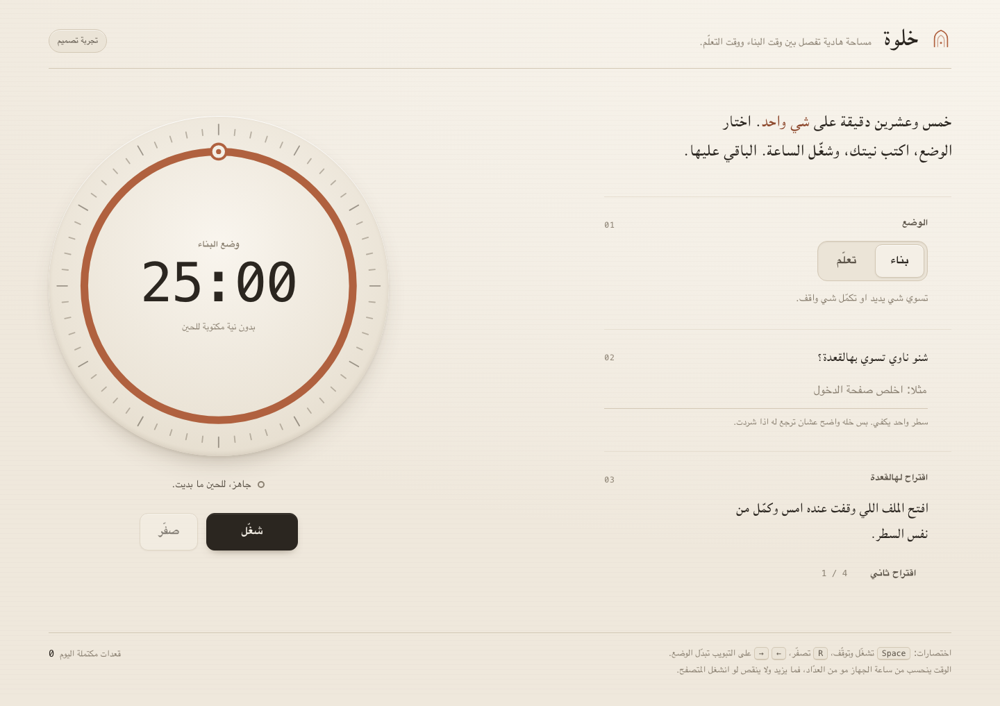

# Claude CLI

**خل Codex يستعين بـ Claude Code وانت مكمل شغلك بنفس المكان.**

[English](README.md)

هالـ plugin يربط Codex بالـ Claude Code CLI الرسمي على جهازك. تقدر تطلب من Claude يراجع الكود، يدقق خطة، او ينفذ تعديل محدد. عقبها Codex يفحص النتيجة ويشغل الاختبارات.

كل واحد يستخدم حساب Claude الخاص فيه. هذي اضافة من المجتمع، مو منتج رسمي من Anthropic او OpenAI.

## شنو تحتاج؟

- جهاز macOS او Linux، وPython 3.10 او احدث. Windows مو مدعوم بهالنسخة.
- Codex يدعم plugins ويقدر يشغل اوامر محلية.
- [Claude Code CLI الرسمي](https://code.claude.com/docs/en/setup)، مع تسجيل دخولك.
- صلاحية استخدام المودل اللي تختاره. تجربة Fable 5.1 تحتاج CLI بنسخة 2.1.257 او احدث.

## التثبيت

تاكد من النسخة وتسجيل الدخول:

```sh
claude --version
claude auth status
```

اذا مو مسجل دخول:

```sh
claude auth login
```

ثبت الاضافة:

```sh
codex plugin marketplace add 0alfares082/claude-cli
codex plugin add claude-cli@claude-cli
```

عقب التثبيت افتح مهمة يديدة في Codex عشان يحمل الاضافة.

## شلون تستخدمه؟

قول لـ Codex:

> استخدم Claude CLI وخل Claude يراجع التغييرات الحالية ويطلع المشاكل المحتملة، بدون ما يعدل الملفات.

او:

> استخدم Claude CLI مع Fable 5.1 عشان يبني صفحة HTML فيها مؤقت تركيز. خله يشتغل على index.html بس، وعقبها افحص التصميم وجرب الازرار.

تقدر تنادي المهارة مباشرة باسم `$claude-cli`.

## شلون يشتغل؟

1. Codex يحدد المطلوب والملفات المسموح تعديلها.
2. يشغل Claude Code CLI الرسمي بحسابك.
3. Claude يرجع النتيجة ويكتب الملفات اذا المهمة تسمح.
4. Codex يراجع التغييرات ويتاكد من الاختبارات.

الوضع الافتراضي قراءة فقط. التعديل يحتاج مهمة تسمح فيه. Claude ما عنده shell او متصفح او MCP بهالتشغيل، وCodex يتولى الاختبارات. هالحدود تقيد الادوات، لكنها مو عزل كامل لنظام الملفات.

## تجربة فعلية

طلبنا من `claude-fable-5-1` يبني صفحة «خلوة». بيانات الاستخدام اللي رجعها الـ CLI سجلت نفس المودل. فحصنا الصفحة على الكمبيوتر والموبايل، وجربنا المؤقت والتبويبات وحفظ النية.



[ملف HTML](examples/khalwa/index.html) · [النسخة الاصلية من المودل](examples/khalwa/index.fable-original.html) · [نتيجة الفحص](examples/khalwa/validation.json)

التصميم والكود من Fable. التعديل عقب التوليد كان كلمات باللهجة فقط. هذي تجربة وحدة، مو مقارنة تثبت ان مودل احسن من الثاني.

لتجربة الصفحة عندك، نزل الـ repo وافتح `examples/khalwa/index.html` بالمتصفح.

## شغلات تعرفها

- الاستهلاك ينحسب على حسابك وشروطه. الاضافة ما تعطي وصول مجاني للمودلات.
- بعض الحسابات تستخدم usage credits مع Fable، فشيك اعدادات حسابك.
- ما تحتاج تشارك كلمة مرورك او مفاتيحك مع صاحب الـ repo.
- تعليمات مشروعك يمررها Codex ضمن المهمة، لان تحميل تخصيصات Claude التلقائي معطل بهالتشغيل.
- اذا المهمة فشلت او انتهت مهلتها، ممكن يكون فيه تعديل جزئي. افحص الملفات قبل تعيدها.
- النتيجة ترجع عقب انتهاء المهمة، مو بث مباشر.

السورس والاختبارات موجودين بالكامل، والترخيص [MIT](LICENSE).
